# CalculatorParserTDD

[GitHub Repository](https://github.com/AlfonsoRodr/CalculatorParserTDD)

## Authors
<table>
  <thead>
    <th>Name</th>
    <th>University Email</th>
    <th>GitHub Account</th>
  </thead>
  <tbody>
    <tr>
      <td>Alfonso Rodríguez Gutt</td>
      <td>a.rodriguezgu.2022@alumnos.urjc.es</td>
      <td>AlfonsoRodr</td>
    </tr>
  <tr>
    <td>Marc Burgos Ucendo</td>
    <td>m.burgos.2022@alumnos.urjc.es</td>
    <td>CazaMopis43</td>
  </tr>
  </tbody>
</table>

## Table of Contents
- [Test Only One Number](#test-only-one-number)
- [Test Arithmethic Sum](#test-arithmethic-sum)
- [Test Arithmethic Substraction](#test-arithmethic-substraction)
- [Mixed Arithmethic Operations](#mixed-arithmethic-operations)
- [Expression with Letters Test](#expression-with-letters-test)

<br>

> [!IMPORTANT]
> To carry out the refactoring process, we applied the `Rule of Three`. This principle suggests that code duplication should only be refactored once it appears at least three times, ensuring that abstractions are introduced only when they are truly justified.

<br>

> [!NOTE]
> We used Visual Studio Code's AI features as a tool to assist with some of the refactorings.

## Test Only One Number

### Test Case 1

### Test Code
````java
@Test
public void TestOneNumber(){
    String operation = "1";
    int res = this.calculator.parse(operation);
    assertEquals(1,res);
}
````

### Test Fail
```log
java.lang.UnsupportedOperationException: Not implemented yet
 at es.codeurjc.test.CalculatorParser.parse(CalculatorParser.java:6)
 at es.codeurjc.test.CalculatorParserTest.TestOneNumber(CalculatorParserTest.java:18)
 at java.base/java.util.ArrayList.forEach(Unknown Source)
 at java.base/java.util.ArrayList.forEach(Unknown Source)
````

### Minimun Functionality
````java
public int parse(String expression) {
    if ("1".equals(expression)) {
        return 1;
    }
    throw new IllegalArgumentException("Expected number 1");
}
````

### Every Test Pass
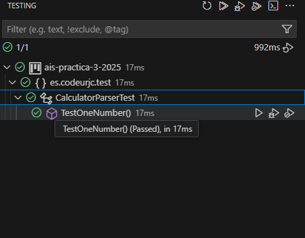

### Test Case 2

### Test Code
````java
@Test
public void TestOneNumber2(){
    String operation = "2";
    int res = this.calculator.parse(operation);
    assertEquals(2,res);
}
````

### Test Fail
```log
**java.lang.IllegalArgumentException: Expected number 1
 at es.codeurjc.test.CalculatorParser.parse(CalculatorParser.java:9)
 at es.codeurjc.test.CalculatorParserTest.TestOneNumber2(CalculatorParserTest.java:24)
 at java.base/java.util.ArrayList.forEach(ArrayList.java:1596)
 at java.base/java.util.ArrayList.forEach(ArrayList.java:1596)
**
````

### Minimun Functionality
````java
public int parse(String expression) {
    if ("1".equals(expression)) {
        return 1;
    } else if("2".equals(expression)) {
        return 2;
    }
    throw new IllegalArgumentException("Expected number 1");
}
````

### Every Test Pass
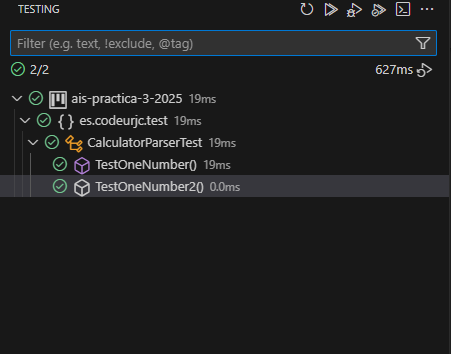

### Test Case 3

### Test Code

````java
@Test
public void TestOneNumber3(){
    String operation = "3";
    int res = this.calculator.parse(operation);
    assertEquals(3,res);
}
````

### Test Fail
````log
java.lang.IllegalArgumentException: Expected number 1
 at es.codeurjc.test.CalculatorParser.parse(CalculatorParser.java:11)
 at es.codeurjc.test.CalculatorParserTest.TestOneNumber3(CalculatorParserTest.java:31)
 at java.base/java.util.ArrayList.forEach(ArrayList.java:1596)
 at java.base/java.util.ArrayList.forEach(ArrayList.java:1596)
````
### Minimun Functionality
````java
 public int parse(String expression) {
      if ("1".equals(expression)) {
          return 1;
      } else if("2".equals(expression)){
          return 2;
      } else if("3".equals(expression)){
          return 3;
      }  
      throw new IllegalArgumentException("Expected number 1");
}
````

### Every Test Pass
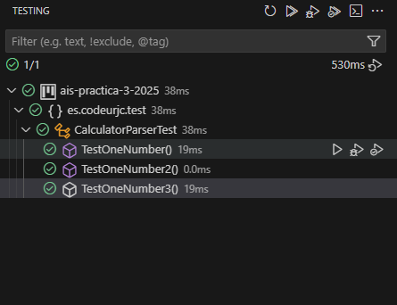

### Refactorization
In this case, a `code smell specifically, duplication` can be observed. Following the `Rule of Three`, we decided to refactor this functionality to eliminate the repeated code and improve maintainability. Additionally, the tests associated with this functionality can be consolidated into a single test using a `@ParameterizedTest`, making the test suite more concise and scalable.

#### Functionality
````java
public int parse(String expression) {
    return Integer.parseInt(expression);
}
````

#### Test

````java
@ParameterizedTest
@ValueSource(strings = {"1", "2", "3"})
public void testOneNumber(String operation) {
    int res = this.calculator.parse(operation);
    assertEquals(Integer.parseInt(operation), res);
}
````

#### Test Pass After Refactoring
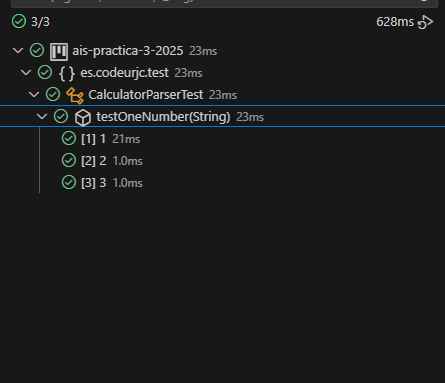

## Test Arithmethic Sum

### Test Case 1

### Test Code
````java
@Test
public void sumTest1() {
    String expression = "1 + 1";
    int res = this.calculator.parse(expression);
    assertEquals(2, res);
}
````

### Test Fail
```log
java.lang.NumberFormatException: For input string: "1 + 1"
 at java.base/java.lang.NumberFormatException.forInputString(Unknown Source)
 at java.base/java.lang.Integer.parseInt(Unknown Source)
 at java.base/java.lang.Integer.parseInt(Unknown Source)
 at es.codeurjc.test.CalculatorParser.parse(CalculatorParser.java:6)
 at es.codeurjc.test.CalculatorParserTest.sumTest1(CalculatorParserTest.java:26)
 at java.base/java.util.ArrayList.forEach(Unknown Source)
 at java.base/java.util.ArrayList.forEach(Unknown Source)
````

### Minimun Functionality
```java
public int parse(String expression) {
    if (expression.equals("1 + 1")) {
        return 2;
    }
    return Integer.parseInt(expression);
}
````

### Every Test Pass
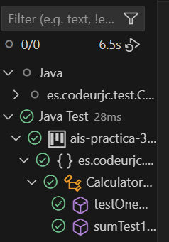

### Test Case 2

### Test Code
````java
@Test
public void sumTest2() {
    String expression = "2 + 3";
    int res = this.calculator.parse(expression);
    assertEquals(5, res);
}
````

### Test Fail
```log
java.lang.NumberFormatException: For input string: "2 + 3"
 at java.base/java.lang.NumberFormatException.forInputString(Unknown Source)
 at java.base/java.lang.Integer.parseInt(Unknown Source)
 at java.base/java.lang.Integer.parseInt(Unknown Source)
 at es.codeurjc.test.CalculatorParser.parse(CalculatorParser.java:9)
 at es.codeurjc.test.CalculatorParserTest.sumTest2(CalculatorParserTest.java:33)
 at java.base/java.util.ArrayList.forEach(Unknown Source)
 at java.base/java.util.ArrayList.forEach(Unknown Source)
````

### Minimun Functionality
```java
public int parse(String expression) {
    if (expression.equals("1 + 1")) {
      return 2;
    }
    else if (expression.equals("2 + 3")) {
      return 5;
    }
    return Integer.parseInt(expression);
}
````

### Every Test Pass
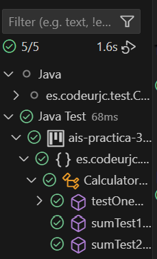

### Test Case 3

### Test Code
````java
@Test
public void sumTest3() {
    String expression = "2 + 3 + 4";
    int res = this.calculator.parse(expression);
    assertEquals(9, res);
}
````

### Test Fail
```log
java.lang.NumberFormatException: For input string: "2 + 3 + 4"
 at java.base/java.lang.NumberFormatException.forInputString(Unknown Source)
 at java.base/java.lang.Integer.parseInt(Unknown Source)
 at java.base/java.lang.Integer.parseInt(Unknown Source)
 at es.codeurjc.test.CalculatorParser.parse(CalculatorParser.java:12)
 at es.codeurjc.test.CalculatorParserTest.sumTest3(CalculatorParserTest.java:40)
 at java.base/java.util.ArrayList.forEach(Unknown Source)
 at java.base/java.util.ArrayList.forEach(Unknown Source)
````

### Minimun Functionality
```java
public int parse(String expression) {
    if (expression.equals("1 + 1")) {
      return 2;
    }
    else if (expression.equals("2 + 3")) {
      return 5;
    }
    else if (expression.equals("2 + 3 + 4")) {
      return 9;
    }
    return Integer.parseInt(expression);
}
````

### Every Test Pass
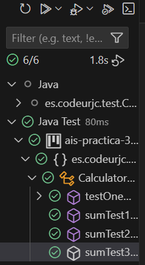

### Refactorization
In this case, a `code smell specifically, duplication` can be observed. Following the `Rule of Three`, we decided to refactor this functionality to eliminate the repeated code and improve maintainability. Additionally, the tests associated with this functionality can be consolidated into a single test using a `@ParameterizedTest`, making the test suite more concise and scalable.

#### Functionality
````java
public int parse(String expression) {
    String[] tokens = expression.split("\\+");
    int result = 0;
    for (String token : tokens) {
        result += Integer.parseInt(token.trim());
    }
    return result;
}
````

#### Test
````java
@ParameterizedTest
@ValueSource(strings = {"1 + 1:2", "2 + 3:5", "2 + 3 + 4:9"})
public void sumTests(String input) {
    String[] parts = input.split(":");
    String expression = parts[0];
    int expected = Integer.parseInt(parts[1]);
    int res = this.calculator.parse(expression);
    assertEquals(expected, res);
}
````

#### Test Pass After Refactoring
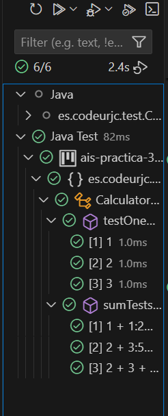

### Test Case 4

> [!IMPORTANT]
> Since we refactored in the previous test case by applying the `Rule of Three`, this new case will pass without requiring further changes to the functionality. The only necessary step is to add this case to the existing `@ParameterizedTest`, ensuring it is properly covered by the updated test suite.

### Test Code
````java
@ParameterizedTest
@ValueSource(strings = {"1 + 1:2", "2 + 3:5", "2 + 3 + 4:9", "1 + 2 + 3 + 4:10"})
public void sumTests(String input) {
    String[] parts = input.split(":");
    String expression = parts[0];
    int expected = Integer.parseInt(parts[1]);
    int res = this.calculator.parse(expression);
    assertEquals(expected, res);
}
````

### Test Fail
The test does not fail due to the reasons explained above.

### Minimun Functionality
It does not require any modifications, based on the explanation provided earlier.

### Every Test Pass
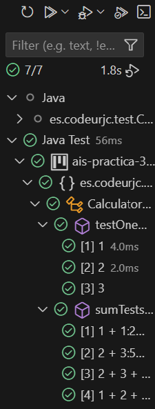

## Test Arithmethic Substraction

### Test Case 1

### Test Code
````java
@Test
public void subTest1() {
    String expression = "5 - 3";
    int res = this.calculator.parse(expression);
    assertEquals(2, res);
}
````

### Test Fail
````log
java.lang.NumberFormatException: For input string: "5 - 3"
 at java.base/java.lang.NumberFormatException.forInputString(NumberFormatException.java:67)
 at java.base/java.lang.Integer.parseInt(Integer.java:662)
 at java.base/java.lang.Integer.parseInt(Integer.java:778)
 at es.codeurjc.test.CalculatorParser.parse(CalculatorParser.java:10)
 at es.codeurjc.test.CalculatorParserTest.subTest1(CalculatorParserTest.java:35)
 at java.base/java.util.ArrayList.forEach(ArrayList.java:1596)
 at java.base/java.util.ArrayList.forEach(ArrayList.java:1596)

````

### Minimun Functionality
````java
public int parse(String expression) {
    if(expression.equals("5 - 3")) {
        return 2;
    }
    String[] tokens = expression.split("\\+");
    int result = 0;
    for (String token : tokens) {
        result += Integer.parseInt(token.trim());
    }
    return result;
}
````

### Every Test Pass
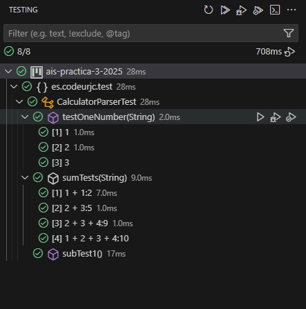

### Test Case 2

### Test Code
````java
@Test
public void subTest2() {
    String expression = "1 - 2";
    int res = this.calculator.parse(expression);
    assertEquals(-1, res);
}
````

### Test Fail
````log
 java.lang.NumberFormatException: For input string: "1 - 2"
 at java.base/java.lang.NumberFormatException.forInputString(NumberFormatException.java:67)
 at java.base/java.lang.Integer.parseInt(Integer.java:662)
 at java.base/java.lang.Integer.parseInt(Integer.java:778)
 at es.codeurjc.test.CalculatorParser.parse(CalculatorParser.java:12)
 at es.codeurjc.test.CalculatorParserTest.subTest2(CalculatorParserTest.java:41)
 at java.base/java.util.ArrayList.forEach(ArrayList.java:1596)
 at java.base/java.util.ArrayList.forEach(ArrayList.java:1596)
````

### Minimun Functionality
````java
public int parse(String expression) {
    if (expression.equals("5 - 3")) {
        return 2;
    } else if (expression.equals("1 - 2")) {
        return -1;
    }
    String[] tokens = expression.split("\\+");
    int result = 0;
    for (String token : tokens) {
        result += Integer.parseInt(token.trim());
    }
    return result;
}
````

### Every Test Pass
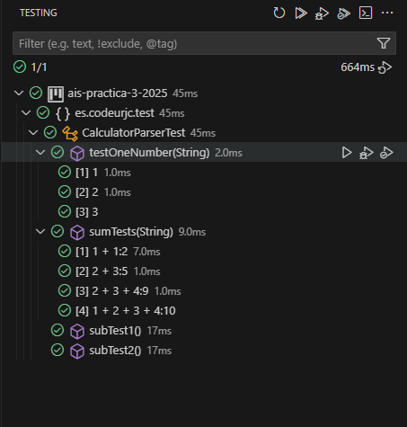

### Test Case 3

### Test Code
````java
@Test
public void subTest3() {
    String expression = "7 - 2 - 1";
    int res = this.calculator.parse(expression);
    assertEquals(4, res);
}
````

### Test Fail
````log
 java.lang.NumberFormatException: For input string: "7 - 2 - 1"
 at java.base/java.lang.NumberFormatException.forInputString(NumberFormatException.java:67)
 at java.base/java.lang.Integer.parseInt(Integer.java:662)
 at java.base/java.lang.Integer.parseInt(Integer.java:778)
 at es.codeurjc.test.CalculatorParser.parse(CalculatorParser.java:14)
 at es.codeurjc.test.CalculatorParserTest.subTest3(CalculatorParserTest.java:47)
 at java.base/java.util.ArrayList.forEach(ArrayList.java:1596)
 at java.base/java.util.ArrayList.forEach(ArrayList.java:1596)
````

### Minimun Functionality
````java
public int parse(String expression) {
    if (expression.equals("5 - 3")) {
        return 2;
    } else if(expression.equals("1 - 2")) {
        return -1;
    } else if (expression.equals("7 - 2 - 1")) {
        return 4;
    }
    String[] tokens = expression.split("\\+");
    int result = 0;
    for (String token : tokens) {
        result += Integer.parseInt(token.trim());
    }
    return result;
}
````

### Every Test Pass
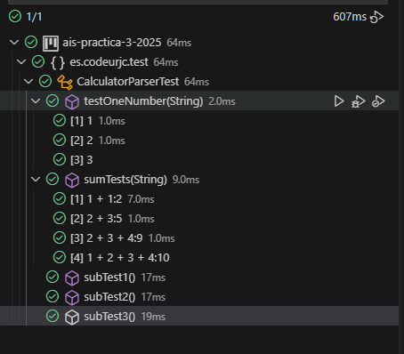

### Refactorization
In this case, a `code smell specifically, duplication` can be observed. Following the `Rule of Three`, we decided to refactor this functionality to eliminate the repeated code and improve maintainability. Additionally, the tests associated with this functionality can be consolidated into a single test using a `@ParameterizedTest`, making the test suite more concise and scalable.

#### Functionality
````java
 public int parse(String expression) {
    if (expression.contains("-")) {
        String[] tokens = expression.split("-");
        int result = Integer.parseInt(tokens[0].trim());
        for (int i = 1; i < tokens.length; i++) {
            result -= Integer.parseInt(tokens[i].trim());
        }
        return result;
    }
    String[] tokens = expression.split("\\+");
    int result = 0;
    for (String token : tokens) {
        result += Integer.parseInt(token.trim());
    }
    return result;
}
````

#### Test
````java
@ParameterizedTest
@ValueSource(strings = {"5 - 3:2", "1 - 2:-1", "7 - 2 - 1:4"})
public void subTests(String input) {
    String[] parts = input.split(":");
    String expression = parts[0];
    int expected = Integer.parseInt(parts[1]);
    int res = this.calculator.parse(expression);
    assertEquals(expected, res);
}
````

#### Test Pass After Refactoring
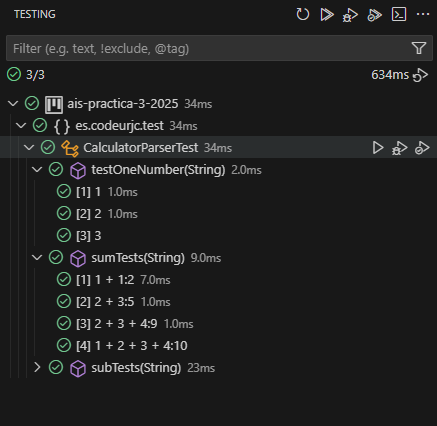

### Test Case 4

> [!IMPORTANT]
> Since we refactored in the previous test case by applying the `Rule of Three`, this new case will pass without requiring further changes to the functionality. The only necessary step is to add this case to the existing `@ParameterizedTest`, ensuring it is properly covered by the updated test suite.

### Test Code
````java
@ParameterizedTest
@ValueSource(strings = {"5 - 3:2", "1 - 2:-1", "7 - 2 - 1:4", "9 - 5 - 3 - 1:0"})
public void subTests(String input) {
    String[] parts = input.split(":");
    String expression = parts[0];
    int expected = Integer.parseInt(parts[1]);
    int res = this.calculator.parse(expression);
    assertEquals(expected, res);
}
````

### Test Fail
The test does not fail due to the reasons explained above.

### Minimun Functionality
It does not require any modifications, based on the explanation provided earlier.

### Every Test Pass
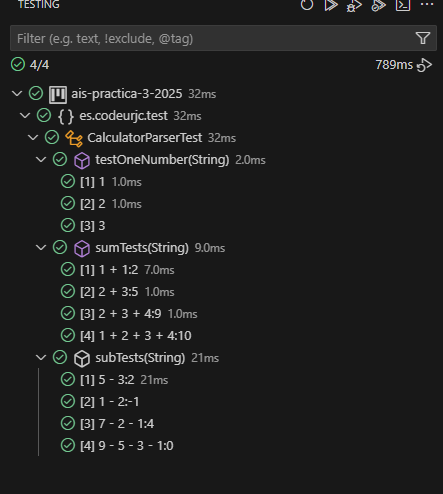

## Mixed Arithmethic Operations

### Test Case 1

### Test Code
```java
@Test
public void mixedOpperations1 () {
    String expression = "7 + 1 - 5";
    int result = this.calculator.parse(expression);
    assertEquals(3, result);
}
````

### Test Fail
```log
java.lang.NumberFormatException: For input string: "7 + 1 - 5"
 at java.base/java.lang.NumberFormatException.forInputString(Unknown Source)
 at java.base/java.lang.Integer.parseInt(Unknown Source)
 at java.base/java.lang.Integer.parseInt(Unknown Source)
 at es.codeurjc.test.CalculatorParser.parse(CalculatorParser.java:11)
 at es.codeurjc.test.CalculatorParserTest.mixedOpperations1(CalculatorParserTest.java:46)
 at java.base/java.util.ArrayList.forEach(Unknown Source)
 at java.base/java.util.ArrayList.forEach(Unknown Source)
````

### Minimun Functionality
```java
public int parse(String expression) {
    if (expression.equals("7 + 1 - 5")) {
        return 3;
    }
    if (expression.contains("-")) {
        String[] tokens = expression.split("-");
        int result = Integer.parseInt(tokens[0].trim());
        for (int i = 1; i < tokens.length; i++) {
          result -= Integer.parseInt(tokens[i].trim());
        }
        return result;
    }
    String[] tokens = expression.split("\\+");
    int result = 0;
    for (String token : tokens) {
        result += Integer.parseInt(token.trim());
    }
    return result;
}
````

### Every Test Pass
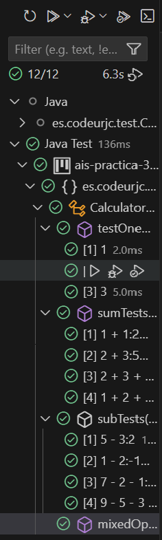

> [!IMPORTANT]
> Since these operations involve both addition and subtraction, we decided to refactor this functionality early, as we identified repeated patterns. As with other test cases, we created a `@ParameterizedTest` that covers all the provided examples for this scenario.

### Refactorization

#### Functionality
````java
 public int parse(String expression) {
      Pattern pattern = Pattern.compile("([+-]?\\d+)");
      Matcher matcher = pattern.matcher(expression.replaceAll("\\s+", ""));
      int result = 0;
      while (matcher.find()) {
          result += Integer.parseInt(matcher.group(1));
      }
      return result;
}
````

#### Test
````java
@ParameterizedTest
@ValueSource(strings = {"7 + 1 - 5:3", "9 - 5 + 4:8", "9 + 1 - 6 - 2:2", "-5 + 9:4"})
public void mixedOperationsTests(String input) {
    String[] parts = input.split(":");
    String expression = parts[0];
    int expected = Integer.parseInt(parts[1]);
    int result = this.calculator.parse(expression);
    assertEquals(expected, result);
}
````

#### Test Pass After Refactoring
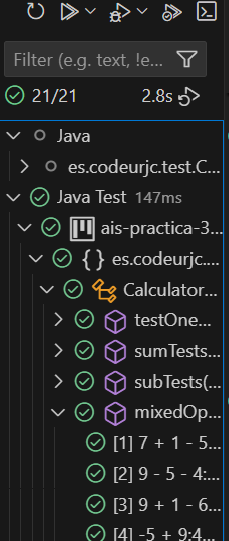

## Expression with Letters Test

### Test Case 1

### Test Code
```java
private static final String ERROR_MESSAGE = "Letters are not allowed";

@Test
public void testSingleLetter1() {
    String expression = "A";
    IllegalArgumentException thrown = assertThrows(IllegalArgumentException.class, () -> { 
        this.calculator.parse(expression); 
    });
    assertEquals(ERROR_MESSAGE, thrown.getMessage());
}
````

### Test Fail
```log
org.opentest4j.AssertionFailedError: Expected java.lang.IllegalArgumentException to be thrown, but nothing was thrown.
 at es.codeurjc.test.CalculatorParserTest.testSingleLetter1(CalculatorParserTest.java:59)
 at java.base/java.util.ArrayList.forEach(Unknown Source)
 at java.base/java.util.ArrayList.forEach(Unknown Source)
```

### Minimun Functionality
```java
public int parse(String expression) {
    if (expression.equals("A")) {
        throw new IllegalArgumentException("Letters are not allowed");
    }
    Pattern pattern = Pattern.compile("([+-]?\\d+)");
    Matcher matcher = pattern.matcher(expression.replaceAll("\\s+", ""));
    int result = 0;
    while (matcher.find()) {
        result += Integer.parseInt(matcher.group(1));
    }
    return result;
}
````

### Every Test Pass
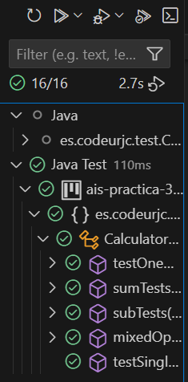

### Test Case 2

### Test Code
```java
private static final String ERROR_MESSAGE = "Letters are not allowed";

@Test
public void testSingleLetter2() {
    String expression = "B";
    IllegalArgumentException thrown = assertThrows(IllegalArgumentException.class, () -> { 
        this.calculator.parse(expression); 
    });
    assertEquals(ERROR_MESSAGE, thrown.getMessage());
}
````

### Test Fail
```log
org.opentest4j.AssertionFailedError: Expected java.lang.IllegalArgumentException to be thrown, but nothing was thrown.
 at es.codeurjc.test.CalculatorParserTest.testSingleLetter2(CalculatorParserTest.java:68)
 at java.base/java.util.ArrayList.forEach(Unknown Source)
 at java.base/java.util.ArrayList.forEach(Unknown Source)
```

### Minimun Functionality
```java
public int parse(String expression) {
    if (expression.equals("A")) {
        throw new IllegalArgumentException("Letters are not allowed");
    }
    else if (expression.equals("B")) {
        throw new IllegalArgumentException("Letters are not allowed");
    }
    Pattern pattern = Pattern.compile("([+-]?\\d+)");
    Matcher matcher = pattern.matcher(expression.replaceAll("\\s+", ""));
    int result = 0;
    while (matcher.find()) {
        result += Integer.parseInt(matcher.group(1));
    }
    return result;
}
````

### Every Test Pass
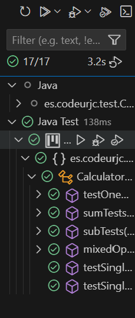

### Refactorization
In this case, a `code smell specifically, duplication` can be observed. We decided to refactor this functionality to eliminate the repeated code and improve maintainability. Additionally, the tests associated with this functionality can be consolidated into a single test using a `@ParameterizedTest`, making the test suite more concise and scalable.

#### Functionality
````java
 public int parse(String expression) {
    String expr = expression.replaceAll("\\s+", "");
    if (expr.matches(".*[A-Za-z].*")) {
        throw new IllegalArgumentException("Letters are not allowed");
    }
    Pattern pattern = Pattern.compile("([+-]?\\d+)");
    Matcher matcher = pattern.matcher(expression.replaceAll("\\s+", ""));
    int result = 0;
    while (matcher.find()) {
        result += Integer.parseInt(matcher.group(1));
    }
    return result;
}
````

#### Test
````java
@ParameterizedTest
@ValueSource(strings = {"A", "B", "k", "HoLa", "1 + A", "Hola + 69 + -678A"})
public void testExpressionWithLetters(String expression) {
    IllegalArgumentException thrown = assertThrows(IllegalArgumentException.class, () -> { 
        this.calculator.parse(expression); 
    });
    assertEquals(ERROR_MESSAGE, thrown.getMessage());
}
````

#### Test Pass After Refactoring
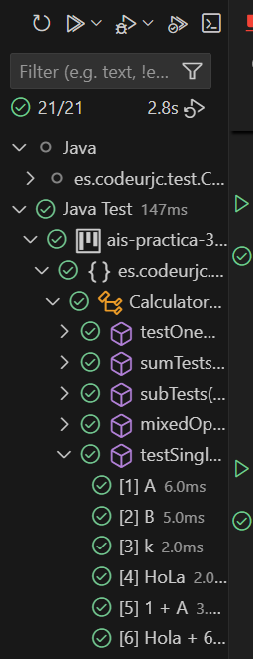
